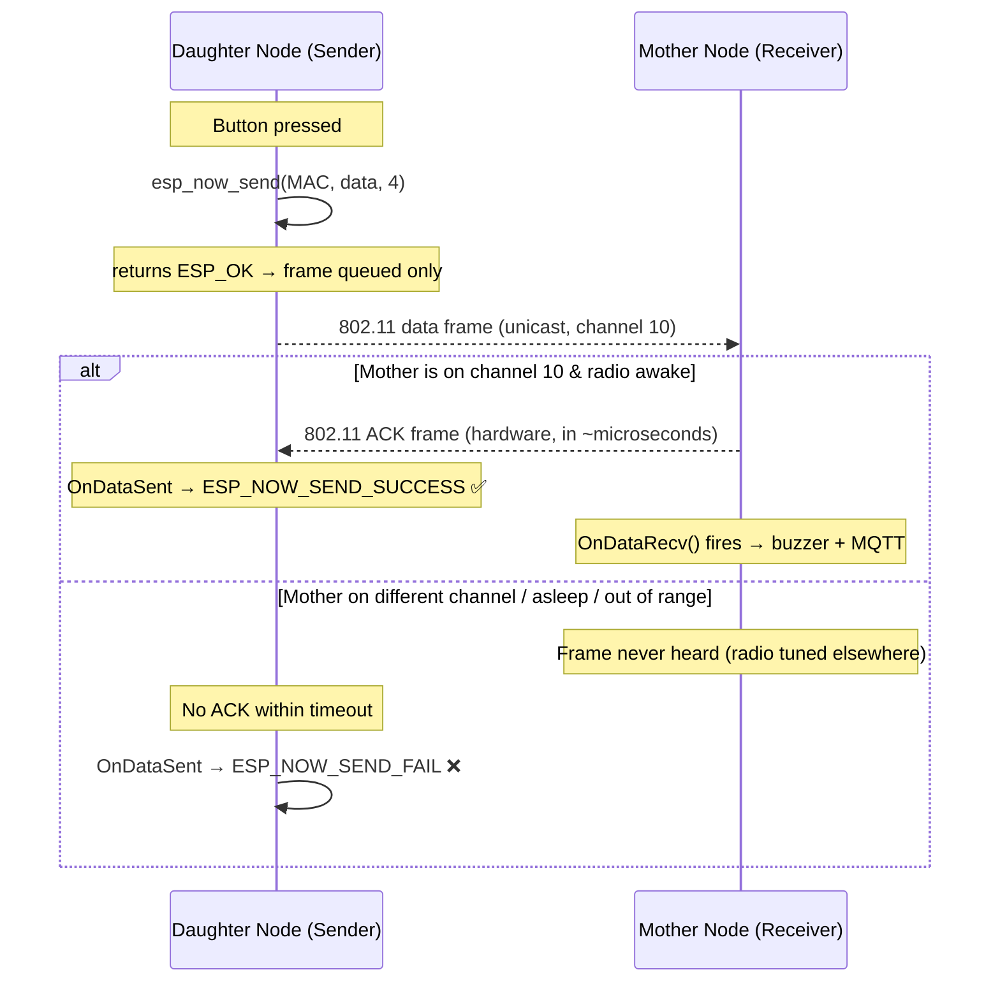
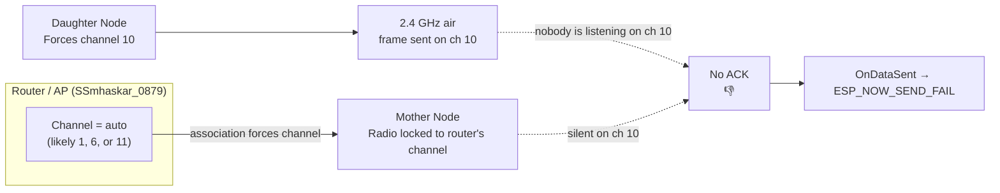
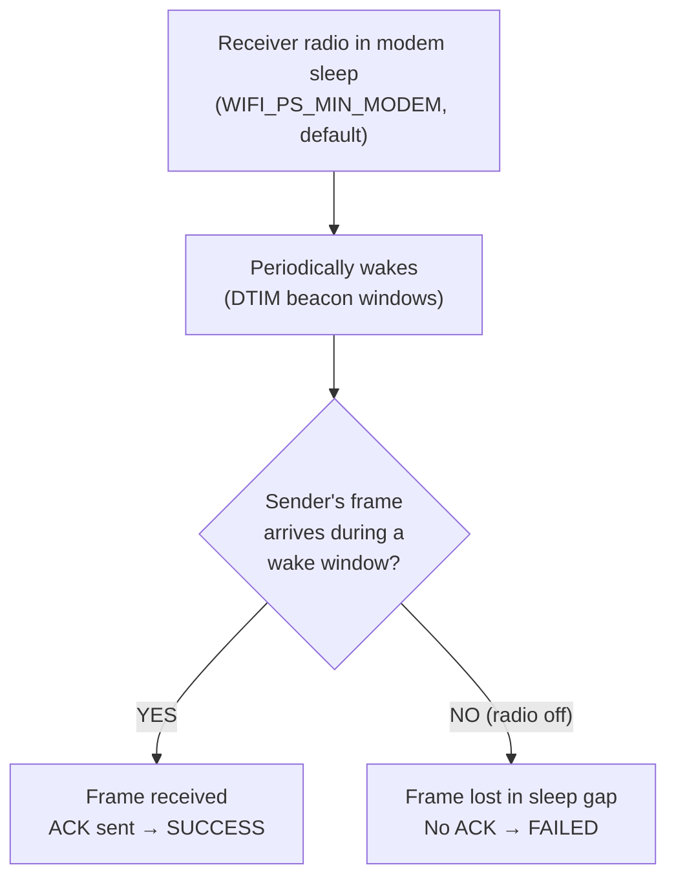
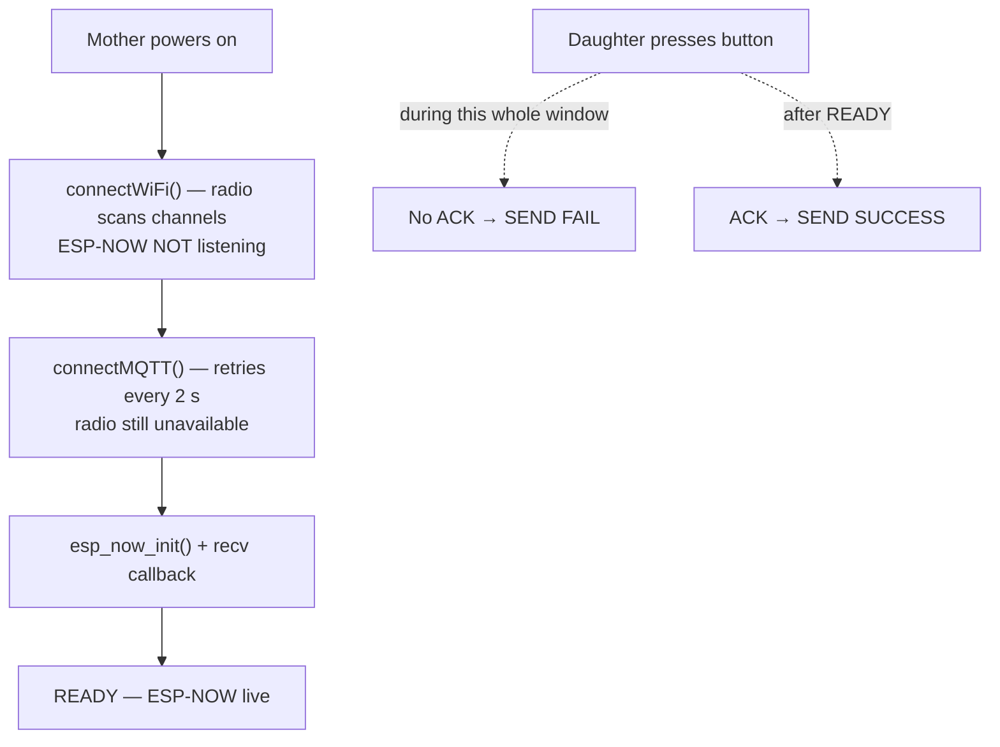
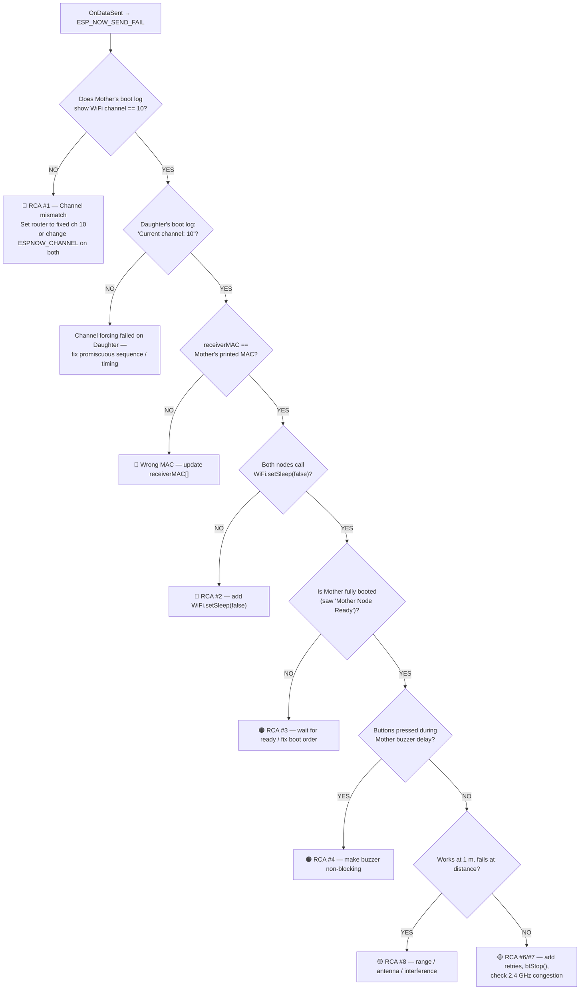

# EXECUTIVE SUMMARY
## ESP-NOW "Send Fail" Analysis — Lakshman Rekha Safety System

**Version:** 1.0 · **Date:** August 2026
**Scope:** Mother Node (ESP-NOW receiver + MQTT) & Daughter Node (ESP-NOW sender, buttons)
**Related doc:** `Daughter_node/LAKSHMAN_REKHA_ENGINEERING_DOCUMENT.md`

---

## 1. TL;DR — Executive Summary

You are seeing **`[ESPNOW] STATUS: FAILED`** in the Daughter Node's serial monitor (from the `OnDataSent` callback) and/or **`[SEND] esp_now_send(): ESP_ERR_*`** errors. The single most important thing to understand:

> **`esp_now_send()` returning `ESP_OK` means nothing about delivery.**
> It only means *"the frame was queued into the radio."* The real verdict comes milliseconds later in the `OnDataSent` callback:
> - `ESP_NOW_SEND_SUCCESS` = the **Mother Node sent back a link-layer ACK** (frame physically received).
> - `ESP_NOW_SEND_FAIL` = **no ACK ever came back.**

So every "send fail" is really a **"receive fail"** — the failure lives on the *receiver's side*, not the sender's. Something is preventing the Mother Node from hearing and ACKing your frames.

### Root causes found (ranked)

| # | Root Cause | Severity | Your Evidence in Code |
|---|-----------|----------|------------------------|
| 1 | **Channel mismatch — Daughter forces ch. 10, Mother lives on the router's channel** | 🔴 CRITICAL | Daughter: `esp_wifi_set_channel(10,…)`; Mother: no channel forcing at all, follows router |
| 2 | **WiFi modem sleep (power save) on both nodes** | 🔴 CRITICAL | Neither node calls `WiFi.setSleep(false)`; Arduino core enables sleep by default |
| 3 | **Mother's radio is busy during blocking WiFi/MQTT connect & reconnect** | 🟠 HIGH | `connectWiFi()` / `connectMQTT()` are blocking `while` loops, run *before* `esp_now_init()` |
| 4 | **Blocking code inside the RX callback** (`delay(500)` buzzer + MQTT publish) | 🟠 HIGH | `delay(500)` + `mqttClient.publish()` inside `OnDataRecv` block the WiFi task |
| 5 | **`printf` format bug — 7 `%02X` specifiers for 6 MAC bytes** | 🟡 MEDIUM | `Daughter_node/src/main.cpp` (2 places) — undefined behavior |
| 6 | **No retry / no delivery guarantee** | 🟡 MEDIUM | Single `esp_now_send()` call, best-effort QoS 0 protocol |
| 7 | **2.4 GHz congestion + Bluetooth coexistence** | 🟡 MEDIUM | Both ESP32s idle with BT enabled by default (`btStop()` never called) |
| 8 | **Physical RF factors (range, antennas, walls)** | 🟡 MEDIUM | ESP-NOW indoor range ~10–40 m; line-of-sight required |

**Bottom line:** Fixing **#1 (channel alignment)** and **#2 (disable power save)** will resolve the *vast majority* of your failures. The other items make the link fragile and should be fixed for reliability.

---

## 2. How ESP-NOW Delivery Actually Works (the ACK contract)



**Plain-English version (ASCII):**

```
Daughter                         Air (2.4 GHz)                      Mother
────────                         ─────────────                      ──────
button press
esp_now_send() → ESP_OK
(only queued!)
     │                               │
     ├──────────── data frame ──────►│  Radio must be on ch.10 AND awake
     │                               │        AND in range
     │                               │   ┌─ yes → sends ACK ──► STATUS: SUCCESS
     │                               │   └─ no  ── (silence) ─► STATUS: FAILED
     ◄──────────── 802.11 ACK ───────┤
OnDataSent() → SUCCESS / FAILED      │
```

### Two separate things people confuse

| Signal | Meaning | Gotcha |
|---|---|---|
| `esp_now_send()` return value | Frame accepted into TX buffer | `ESP_OK` ≠ delivered! |
| `OnDataSent(status)` | **Actual delivery verdict** | `FAIL` = receiver never ACKed |

> ⚠️ **Note:** In your current code the callback *only tells you if the frame was ACKed at the radio level.* It does **not** mean the Mother processed it, published MQTT, or sounded the buzzer — those are downstream of a successful RX and can fail separately.

---

## 3. Current Configuration (from code + platformio.ini)

### Daughter Node (sender) — `Daughter_node/src/main.cpp`
| Setting | Value |
|---|---|
| Buttons | GPIO 27 → INTRUSION (`value=1`), GPIO 25 → SOS (`value=2`) |
| WiFi mode | `WIFI_STA` (not associated to any AP) |
| **Channel** | **Forced to 10** via `esp_wifi_set_promiscuous(true)` → `esp_wifi_set_channel(10)` → `false` |
| Peer | Mother MAC `B0:CB:D8:C6:A5:A8`, `channel=10`, no encryption |
| Power save | ❌ **Not disabled** (defaults apply) |
| Retry | ❌ None — one shot per button press |

### Mother Node (receiver) — `Mother_node/src/main.cpp`
| Setting | Value |
|---|---|
| WiFi | Connects to `SSmhaskar_0879` — **channel decided by the router (auto)** |
| **Channel** | ❌ **Never forced to 10** — whatever channel the router assigns |
| Buzzer | GPIO 26, `delay(500)` **inside the RX callback** |
| MQTT | `broker.emqx.io:1883`, topic `lakshmanrekha/alerts`, QoS 0 |
| ESP-NOW init | Happens **after** blocking WiFi + MQTT connects |
| Power save | ❌ **Not disabled** — modem sleep ON by default in Arduino core |
| RX peer | Does **not** add Daughter as a peer (OK for RX, but blocks any future TX/status back to Daughter) |

---

## 4. Root Cause Analysis (RCAs)

### 🔴 RCA #1 — Channel Mismatch: Daughter on ch. 10, Mother on the router's channel

This is **the #1 reason you "constantly" get send failures.**

**What the code does:**

```
Daughter Node                              Mother Node
────────────                               ───────────
WiFi.mode(WIFI_STA)                        WiFi.mode(WIFI_STA)
esp_wifi_set_channel(10, …)  ← forces 10   WiFi.begin(ssid, pwd)  ← follows AP
                                            channel = router's choice (auto: 1/6/11/…)
```

**The physical reality:** A WiFi radio can only listen on **one channel at a time**. Because the Mother Node is *associated* with the router, it is **locked to the router's channel** (whatever the router picked, often 1, 6, or 11). Your Daughter transmits on channel 10. The Mother's radio never tunes to 10 → it never hears the frame → never sends the ACK → Daughter reports **FAILED**.

**Flowchart:**



**Why it feels "constant":** Router auto-channel rarely lands on 10. Even when it does, the router may **re-select channels** (reboot, interference, DFS) and silently move the Mother to a different channel, breaking the link again. This makes the failure appear random-but-frequent — which matches your experience.

**The one exception:** ESP-NOW *broadcast* frames (and certain configs) can sometimes be sniffed by scanning, but **unicast to a registered peer requires both devices on the same channel.** You are using unicast — so alignment is mandatory.

> **Fix (choose one):**
> 1. **Best:** Set your router to a **fixed channel 10** (disable "auto channel") in the router admin page. Mother then associates on 10 and both match.
> 2. Alternative: Pick the router's actual channel and use that value for `ESPNOW_CHANNEL` on **both** nodes.

---

### 🔴 RCA #2 — WiFi Modem Sleep (Power Save) Silences the Radio

Even with matching channels, ESP-NOW fails if the receiver's radio is asleep.

**What the code does:** Neither node calls `WiFi.setSleep(false)`. The ESP32 Arduino core **enables modem sleep by default** (`WIFI_PS_MIN_MODEM`).

**What that means:**



The sender and receiver are **not synchronized** — the Daughter fires at a random instant, and if that instant falls in the Mother's sleep gap, the frame is lost. This turns a healthy link into a **coin-flip** delivery rate. Same applies the other direction if you ever add a Mother→Daughter message.

> **Fix:** Call `WiFi.setSleep(false);` in `setup()` on **both** nodes (right after `WiFi.mode(WIFI_STA)`). Trade-off: ~15–30 mA extra current draw — irrelevant for a mains-powered Mother, acceptable for a battery Daughter in this use case.

---

### 🟠 RCA #3 — Mother's Radio Is Busy During Blocking WiFi/MQTT Connects

```cpp
// Mother setup() — current order
connectWiFi();      // while (WiFi.status() != WL_CONNECTED) { delay(500); }  ← can block 5–30 s
connectMQTT();      // while (!connected) { … delay(2000); }                  ← retries forever
esp_now_init();     // ESP-NOW not even initialized until now
```

**Flowchart of the boot window:**



During the WiFi scan/associate phase the radio is busy channel-hopping; during MQTT retries it's idling with power save. **Any alert pressed during boot or a reconnect gets dropped.** The same blocking loops run again in `loop()` on every WiFi/MQTT drop.

> **Fixes:** initialize ESP-NOW *before* the blocking connects where possible; cap reconnect attempts with a timeout; and consider `WiFi.setSleep(false)` + a non-blocking reconnect pattern so ESP-NOW stays live even when internet drops.

---

### 🟠 RCA #4 — Blocking Code Inside the RX Callback (`delay(500)` + MQTT publish)

```cpp
void OnDataRecv(...) {
    …
    mqttClient.publish(mqttTopic, payload);   // network I/O inside WiFi task
    digitalWrite(BUZZER_PIN, HIGH);
    delay(500);                                // ← blocks the WiFi/ESP-NOW task 500 ms
    digitalWrite(BUZZER_PIN, LOW);
}
```

In ESP-IDF, `OnDataRecv` runs in the **WiFi task**. Every millisecond it spends blocked is a millisecond the radio's receive path is stalled:

- Subsequent ESP-NOW packets are **delayed or dropped** (buffer overflow under bursts).
- The ACK to the *sender* is handled by hardware, so the first packet usually gets its ACK — but a second press during the 500 ms window is lost.
- Rapid SOS spam (`value=2` repeatedly) will visibly drop packets.

> **Fix:** Move the buzzer to a **non-blocking `millis()` state machine** in `loop()`, and push MQTT publishing onto a queue handled outside the callback. The callback should only copy data + set a flag.

---

### 🟡 RCA #5 — `printf` Format Bug (7 `%02X` for 6 bytes)

Both MAC print lines in `Daughter_node/src/main.cpp` have **7 format specifiers but only 6 arguments**:

```cpp
Serial.printf("[ESPNOW] Receiver: %02X:%02X:%02X:%02X:%02X:%02X:%02X\n",
              mac_addr[0], mac_addr[1], mac_addr[2], mac_addr[3], mac_addr[4], mac_addr[5]); // 6 args, 7 %02X
```

This is **undefined behavior** — `printf` will read the 7th value from the stack (garbage) and the serial output shows `XX:XX:XX:XX:XX:XX:??`. On some toolchains this can corrupt the stack and crash the ESP32 mid-transmission. Not the cause of *send fail*, but it must be fixed because it makes your logs **misleading** while you're debugging the real issue.

> **Fix:** Drop one `%02X` from both lines (in `OnDataSent` and `setup`).

---

### 🟡 RCA #6 — No Retry / Delivery Guarantee

ESP-NOW is **best-effort** (like UDP). A single `esp_now_send()` with no retry means one interference spike or one power-save gap = **alert lost forever**. For a *safety* device, that's unacceptable.

> **Fix:** Add an automatic retry: track the last `OnDataSent` status; if `FAILED`, re-send up to 3 times with ~50–100 ms backoff. Consider sending each alert twice by design (idempotent on the receiver — value dedupe) to make delivery highly probable.

---

### 🟡 RCA #7 — 2.4 GHz Congestion & Bluetooth Coexistence

- Both ESP32s sit in the crowded 2.4 GHz ISM band shared with the router, phones, microwaves, etc.
- The Arduino core enables **Bluetooth by default** on both boards. BT and WiFi share the same radio and antennas; even idle BT can cause RF desense and missed frames.
- Channel 10 may be shared with a neighboring AP — walk around to see success rate change with location.

> **Fix:** `btStop();` at the top of `setup()` on both nodes if BT isn't used. Keep nodes away from the router/metal objects.

---

### 🟡 RCA #8 — Physical Range & RF Factors

ESP-NOW typical indoor range is **10–40 m with line-of-sight**. Walls, the human body (wearing the Daughter Node!), antenna orientation, and battery voltage all reduce it. If failures increase when you move/walk with the button, this is a factor.

> **Fix:** Test at 1–2 m distance, antennas perpendicular to each other, to isolate RF from software causes.

---

## 5. Diagnosis Decision Tree (use this when you see `STATUS: FAILED`)



**How to read your serial log:** Mother's `[WIFI] WiFi Channel: X` at boot is the single most diagnostic line in the project. If `X != 10`, you have found your constant-fail cause.

---

## 6. Recommended Fix Plan (priority order)

| Priority | Fix | Files | Effort |
|---|---|---|---|
| **P0** | Set router to **fixed channel 10** (disable auto) | Router admin UI | 5 min |
| **P0** | `WiFi.setSleep(false);` after `WiFi.mode(WIFI_STA)` on **both** nodes | Both `main.cpp` | trivial |
| **P0** | Fix `printf` — 6 `%02X` not 7 | `Daughter_node/src/main.cpp` | trivial |
| **P1** | Verify Mother's channel at boot; print + assert it matches `ESPNOW_CHANNEL` | `Mother_node/src/main.cpp` | small |
| **P1** | Move `esp_now_init()` + recv callback **before** blocking connects; add reconnect timeouts | `Mother_node/src/main.cpp` | small |
| **P1** | Make buzzer non-blocking (`millis()` state machine); move MQTT publish out of callback | `Mother_node/src/main.cpp` | medium |
| **P2** | Add retry-on-fail (≤3 tries) + optional duplicate send in Daughter | `Daughter_node/src/main.cpp` | small |
| **P2** | `btStop();` on both nodes | Both `main.cpp` | trivial |
| **P2** | Add Daughter as peer on Mother (enables status/ACK back + diagnostics) | `Mother_node/src/main.cpp` | small |
| **P3** | Add a heartbeat/watchdog: Daughter sends `value=0` heartbeat every 5 s; Mother detects link loss and logs it | Both `main.cpp` | medium |

### P0 code snippet — both nodes

```cpp
void setup() {
  Serial.begin(115200);
  WiFi.mode(WIFI_STA);
  WiFi.setSleep(false);          // ★ keep the radio awake for ESP-NOW
  btStop();                      // ★ free the radio from Bluetooth coexistence
  // … rest of setup …
}
```

### P0 code snippet — Daughter `printf` fix (2 places)

```cpp
// OnDataSent callback
Serial.printf("[ESPNOW] Receiver: %02X:%02X:%02X:%02X:%02X:%02X\n",
              mac_addr[0], mac_addr[1], mac_addr[2],
              mac_addr[3], mac_addr[4], mac_addr[5]);

// setup() peer banner
Serial.printf("[ESPNOW] Mother MAC: %02X:%02X:%02X:%02X:%02X:%02X\n",
              receiverMAC[0], receiverMAC[1], receiverMAC[2],
              receiverMAC[3], receiverMAC[4], receiverMAC[5]);
```

### P2 code snippet — Daughter retry on fail

```cpp
volatile bool lastSendFailed = false;

void OnDataSent(const uint8_t *mac_addr, esp_now_send_status_t status) {
  lastSendFailed = (status != ESP_NOW_SEND_SUCCESS);
  Serial.println(lastSendFailed ? "[ESPNOW] STATUS: FAILED" : "[ESPNOW] STATUS: SUCCESS");
}

void sendMessage(int messageValue, const char *messageName) {
  outgoingData.value = messageValue;
  for (int attempt = 1; attempt <= 3; attempt++) {
    lastSendFailed = false;
    esp_now_send(receiverMAC, (uint8_t *)&outgoingData, sizeof(outgoingData));
    delay(100);                                  // give the callback time to fire
    if (!lastSendFailed) return;                 // ACKed → done
    Serial.printf("[SEND] Retry %d/3 failed, re-sending...\n", attempt);
  }
}
```

---

## 7. Verification Checklist (after applying fixes)

- [ ] Router admin: **channel fixed to 10**, auto-channel OFF.
- [ ] Mother boot log shows `[WIFI] WiFi Channel: 10`.
- [ ] Daughter boot log shows `[WIFI] Current channel: 10`.
- [ ] Both logs show `WiFi.setSleep(false)` applied (or add a boot print confirming it).
- [ ] Both MACs match: Daughter's `receiverMAC` == Mother's printed MAC.
- [ ] MAC prints show exactly `XX:XX:XX:XX:XX:XX` (6 octets, no stray byte).
- [ ] Press INTRUSION → Mother prints `========== ESP-NOW RECEIVED ==========` and `Event : INTRUSION` within ~1 s.
- [ ] `OnDataSent` shows `STATUS: SUCCESS` for **every** press at 1–2 m distance.
- [ ] Press 5 times rapidly (every 0.5 s) → all 5 received (validates RCA #4 fix).
- [ ] Move to the furthest intended location → success rate still ≥ 95% (else RCA #8).
- [ ] MQTT: EMQX broker shows `intrusion` / `sos` on `lakshmanrekha/alerts`.

---

## 8. Appendix — Quick Reference Card

| Symptom | Likely Cause | Action |
|---|---|---|
| **Always** `STATUS: FAILED` | RCA #1 channel mismatch / RCA #2 power save / wrong MAC | Align channels → set sleep off → verify MAC |
| **Sometimes** FAILED, **sometimes** SUCCESS | RCA #3 boot window / RCA #4 blocked callback / RCA #8 RF | Order init early, non-blocking buzzer, reduce distance |
| `esp_now_send()` returns `ESP_ERR_ESPNOW_NOT_FOUND` | Peer not added / wrong MAC | Check `esp_now_add_peer()` succeeded |
| `esp_now_send()` returns `ESP_ERR_ESPNOW_NO_MEM` | TX buffer full (spamming) | Add rate limiting / retry backoff |
| Mother logs show "Invalid packet size" | Struct mismatch between nodes | Keep `struct_message` identical (4 bytes) on both |
| Mother logs "MQTT Not Connected" | Internet down / broker blocked | WiFi up first; MQTT is *after* ESP-NOW in the chain |

---

*Generated from code review of `Daughter_node/src/main.cpp`, `Mother_node/src/main.cpp`, and `platformio.ini` on Aug 2026. Channel/ACK behavior verified against ESP-IDF ESP-NOW documentation and Espressif best practices.*
