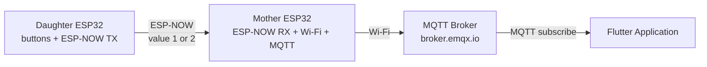
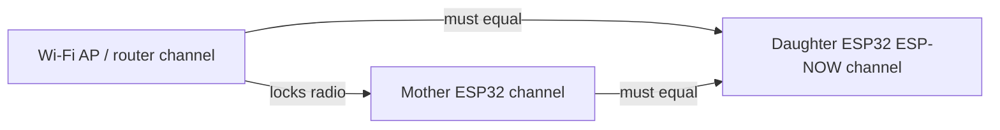
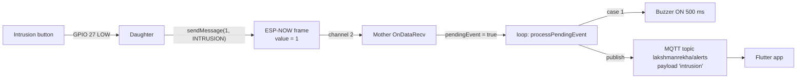
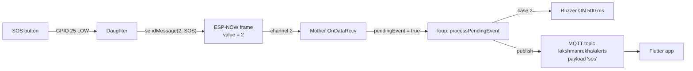
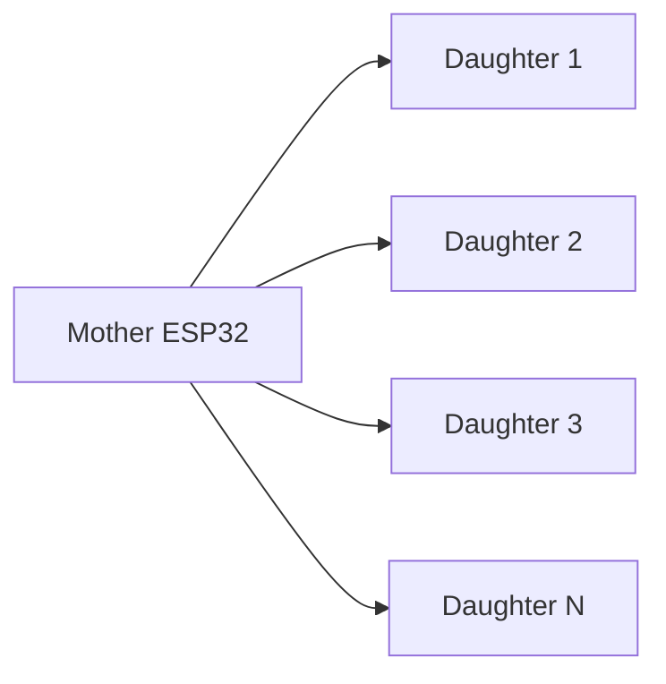

# Lakshman Rekha — ESP32 Mother/Daughter Alert System

> This README describes the current Lakshman Rekha ESP32 prototype. Some values are intentionally hardcoded for the prototype and must be changed carefully when hardware or network configuration changes.

**Status:** Prototype. Values labelled `HARDCODED` live directly in source code; `CONFIGURATION` values are per-network/per-deployment settings; `RUNTIME VALUE` values are read from the serial monitor; `SECRET` values must never be committed to Git; `HARDWARE DEPENDENCY` values must match physical wiring.

---

## 1. Project Overview

**Lakshman Rekha** is a prototype panic/security-alert system built on two ESP32 boards. Physical buttons on a remote "Daughter" node generate alerts that are delivered — **without the internet** — to a central "Mother" node over **ESP-NOW** (Espressif's low-latency, connectionless 2.4 GHz protocol). The Mother then bridges the alert to the internet via **MQTT**, where a **Flutter application** can display it.

The system is deliberately layered so the critical alert path (button → Daughter → Mother → buzzer) works even if the internet or MQTT is down.

### Architecture



### Node responsibilities

| | Daughter ESP32 | Mother ESP32 |
|---|---|---|
| Reads physical buttons | ✅ GPIO 27 (intrusion), GPIO 25 (SOS) | ❌ |
| Generates alert codes (`1`, `2`) | ✅ | ❌ |
| Sends via ESP-NOW | ✅ (transmitter) | ❌ |
| Receives ESP-NOW packets | ❌ | ✅ (receiver) |
| Decodes alert codes | ❌ | ✅ |
| Activates local buzzer | ❌ | ✅ (GPIO 26) |
| Connects to Wi-Fi | ❌ *(`HARDCODED` — not in current Daughter source)* | ✅ |
| Publishes MQTT | ❌ — the Daughter must **not** use MQTT | ✅ |
| Acts as ESP-NOW ↔ internet bridge | ❌ | ✅ |

---

## 2. Hardware

Current prototype hardware (`HARDWARE DEPENDENCY`):

| Device | Notes |
|---|---|
| Daughter ESP32 | One ESP32 dev board (generic `esp32dev` target). Transmits alerts. |
| Mother ESP32 | One ESP32 dev board (generic `esp32dev` target). Receives, buzzes, bridges to MQTT. |
| Intrusion button | Momentary push button on Daughter GPIO 27. |
| SOS button | Momentary push button on Daughter GPIO 25. |
| Mother buzzer | Active/passive buzzer on Mother GPIO 26. |
| Wi-Fi router/hotspot | 2.4 GHz access point that the Mother joins for MQTT. Must serve the same channel the Daughter uses (see [Section 4](#4-esp-now-channel-configuration)). |
| MQTT broker | `broker.emqx.io` (public EMQX broker), port `1883`. |
| Flutter application | External app (not in this repository) that subscribes to the MQTT topic. |

### Hardware connection table

| Device | GPIO | Function | Logic | Note |
|---|---|---|---|---|
| Daughter ESP32 | GPIO 27 | Intrusion button | `INPUT_PULLUP`, active-low | Wire button between GPIO 27 and GND |
| Daughter ESP32 | GPIO 25 | SOS button | `INPUT_PULLUP`, active-low | Wire button between GPIO 25 and GND |
| Mother ESP32 | GPIO 26 | Buzzer | Active-high output | Buzzer driven HIGH for 500 ms on alert |
| Mother ESP32 | — | Wi-Fi antenna | — | Connect the Mother to the same 2.4 GHz network used for MQTT |

> **Not specified in current source:** ESP32 board models, buzzer model (active vs passive), button models, wiring diagram images, power source. Only the GPIO numbers above are defined in code.

### Why `INPUT_PULLUP` and active-low buttons

Both buttons are configured with `pinMode(pin, INPUT_PULLUP)`:

- The ESP32's **internal pull-up resistor** holds the pin at **HIGH (3.3 V)** when the button is not pressed.
- The button connects the pin to **GND**. While pressed the pin is pulled to **LOW (0 V)**.
- Therefore: **Button released = HIGH, Button pressed = LOW.**

This means no external resistors are needed — each button needs only **two wires** (GPIO → button → GND).

---

## 3. Hard-Coded Configuration

All values below were extracted from the current source (`Daughter_node/src/main.cpp`, `Mother_node/src/main.cpp`, and both `platformio.ini` files). `RUNTIME VALUE` entries are printed by the firmware and must be read from the serial monitor — they are **not** constants in code.

| Parameter | Current Value | Used By | Purpose | Can Change? | What Else Must Change? |
|---|---|---|---|---|---|
| `ESPNOW_CHANNEL` *(HARDCODED)* | **2** | Daughter | Fixed ESP-NOW radio channel (forced via promiscuous trick) | Yes | The router's Wi-Fi channel must be set to the **same** channel (see [Section 4](#4-esp-now-channel-configuration)) |
| `ESPNOW_CHANNEL` *(HARDCODED)* | **10** | Mother | Reference/preferred label only — the Mother's actual radio channel is its Wi-Fi AP's channel | Yes | The Daughter's `ESPNOW_CHANNEL` + the router's channel (see the **known discrepancy** note below) |
| `receiverMAC[]` (Mother MAC) *(HARDCODED)* | `B0:CB:D8:C6:A5:A8` | Daughter | Destination MAC for every ESP-NOW send | Yes (if the physical Mother is replaced) | Nothing else — but must equal the real Mother's printed MAC (see [Section 5](#5-mac-address-configuration)) |
| `INTRUSION_BUTTON_PIN` *(HARDCODED)* | **27** | Daughter | Intrusion button input | Yes | Physical wiring to the new GPIO |
| `SOS_BUTTON_PIN` *(HARDCODED)* | **25** | Daughter | SOS button input | Yes | Physical wiring to the new GPIO |
| `BUZZER_PIN` *(HARDCODED)* | **26** | Mother | Buzzer output | Yes | Physical wiring to the new GPIO |
| `BUZZER_ON_MS` *(HARDCODED)* | **500** (ms) | Mother | Buzzer duration per alert | Yes | Nothing |
| `MSG_INTRUSION` *(HARDCODED)* | **1** | Daughter | Alert code sent for intrusion | Yes | Mother's `case 1:` mapping and the MQTT payload mapping (`"intrusion"`) |
| `MSG_SOS` *(HARDCODED)* | **2** | Daughter | Alert code sent for SOS | Yes | Mother's `case 2:` mapping and the MQTT payload mapping (`"sos"`) |
| MQTT payload `"intrusion"` *(HARDCODED)* | `intrusion` | Mother | Published when `value == 1` | Yes | The Flutter app's expected payload |
| MQTT payload `"sos"` *(HARDCODED)* | `sos` | Mother | Published when `value == 2` | Yes | The Flutter app's expected payload |
| `mqttServer` *(HARDCODED)* | `broker.emqx.io` | Mother | MQTT broker host | Yes | The Flutter app must subscribe on the same broker |
| `mqttPort` *(HARDCODED)* | **1883** | Mother | MQTT TCP port (plaintext) | Yes | The Flutter app's port |
| `mqttTopic` *(HARDCODED)* | `lakshmanrekha/alerts` | Mother | MQTT publish topic | Yes | The Flutter app's subscription topic |
| MQTT client ID *(HARDCODED)* | `MotherESP32` | Mother | Client identity on the broker | Yes | On shared/public brokers, a duplicate client ID kicks the other session — keep it unique per device |
| `ssid` *(CONFIGURATION)* | `SSmhaskar_0879` | Mother | Wi-Fi network name | Yes | Router config |
| `password` *(SECRET — hardcoded in `Mother_node/src/main.cpp`, **not reproduced here**)* | `configured locally / DO NOT COMMIT` | Mother | Wi-Fi password | Yes | Move to a config mechanism (see warning below) |
| `expectedDaughterMAC[]` *(CONFIGURATION)* | `00:00:00:00:00:00` (all zeros = **disabled**) | Mother | Optional sender verification | Yes | Fill with the Daughter's actual MAC (from Daughter serial output) |
| Retry count *(HARDCODED)* | **3** attempts | Daughter | ESP-NOW send retries | Yes | Nothing |
| Retry/callback wait *(HARDCODED)* | **100 ms** (`delay(100)`) | Daughter | Time allowed for the send callback verdict | Yes | Nothing |
| Button debounce *(HARDCODED)* | **200 ms** (`delay(200)`) | Daughter | Post-press debounce hold | Yes | Nothing |
| Loop throttle *(HARDCODED)* | **10 ms** (`delay(10)`) | Daughter | Loop pacing | Yes | Nothing |
| Mother Wi-Fi connect timeout *(HARDCODED)* | **15 000 ms** | Mother | Max time to join Wi-Fi | Yes | Nothing |
| Mother MQTT connect timeout *(HARDCODED)* | **10 000 ms** (retry gap 2 000 ms) | Mother | Max time to reach broker | Yes | Nothing |
| Serial baud *(CONFIGURATION)* | **115200** | Both | Debug serial + PIO monitor | Yes | Monitor settings |
| `upload_port` / `monitor_port` *(CONFIGURATION)* | **COM5** (both projects!) | Both | Flash + monitor port | Yes | Set each board to its own COM port; only one board can be on COM5 |
| `upload_speed` *(CONFIGURATION)* | Daughter `115200`, Mother `921600` | Both | Flash speed | Yes | Nothing |
| `peerInfo.encrypt` *(HARDCODED)* | `false` | Daughter | ESP-NOW link encryption | Yes (prototype) | Both nodes would need matching keys — **not implemented** (see [Section 19](#19-security-notes)) |
| `board` / `framework` *(CONFIGURATION)* | `esp32dev` / `arduino` | Both | PlatformIO build target | Yes | Board replacement |
| `PubSubClient@^2.8` *(CONFIGURATION)* | `knolleary/PubSubClient@^2.8` | Mother (`lib_deps`) | MQTT client library | Yes | Nothing |

### Runtime values (read from serial, not code)

| Parameter | Value |
|---|---|
| Daughter's own MAC | `RUNTIME VALUE` — printed at Daughter boot (`[WIFI] Daughter MAC: …`) |
| Mother's own MAC | `RUNTIME VALUE` — printed at Mother boot (`Mother MAC: …`) |
| Actual radio channel | `RUNTIME VALUE` — Daughter prints `Actual radio channel: N`; Mother prints `Actual Wi-Fi Channel: N` |
| Mother's IP address | `RUNTIME VALUE` — printed after Wi-Fi connect |

### ⚠️ Known discrepancy in the current source

- The **Daughter hard-forces channel `2`** and peers with the Mother on channel `2`.
- The **Mother's** `ESPNOW_CHANNEL` define is **`10`**, but it is only used to label the boot output. The Mother's *real* channel is whatever channel its Wi-Fi router uses.
- **Operative rule for the current code:** the router/hotspot's 2.4 GHz channel **must be `2`** for the Daughter's fixed channel to match the Mother's radio. The Mother's boot text still mentions "the Daughter follows this WiFi" — that message is leftover from an earlier design and is no longer what the Daughter does.

### ⚠️ Credential warning

The Wi-Fi password is hardcoded in `Mother_node/src/main.cpp`. **Do not commit this repository with a real password**, and prefer moving credentials out of source eventually (e.g., PlatformIO `build_flags`, an `extra_scripts` generated header, `secrets.h` in `.gitignore`, or NVS).

---

## 4. ESP-NOW Channel Configuration

### Why both nodes MUST be on the same channel

ESP-NOW unicast is a Wi-Fi link-layer protocol: the sender transmits a data frame and the receiver must answer with a link-layer **ACK**. An ESP32 has **one radio** that can listen on **one channel at a time**. If the Daughter transmits on channel 2 but the Mother's radio is tuned to channel 6, the Mother never hears the frame, never ACKs, and the Daughter reports **`ESP-NOW STATUS: FAILED`**.

The channel relationship is:



```
Mother Wi-Fi AP channel
        =
Mother ESP32 radio channel
        =
Daughter ESP32 ESP-NOW channel      <- if these differ, ESP-NOW fails
```

### The critical rule: `#define` does not force the radio

```c
#define ESPNOW_CHANNEL 2     // (current Daughter value)
```

does **not** automatically put the Mother on channel 2. The **Mother is connected to Wi-Fi**, so its radio is locked to the **access point's channel** (usually 1, 6, or 11). For example:

- Mother Wi-Fi = Channel **6**
- Daughter ESP-NOW = Channel **2**

→ ESP-NOW communication **will fail** (no ACK, `STATUS: FAILED`).

### Current configuration (from source)

| Node | Define | What it actually does |
|---|---|---|
| Daughter | `ESPNOW_CHANNEL 2` | Forces the radio to channel 2 via `esp_wifi_set_promiscuous(true)` → `esp_wifi_set_channel(2, …)` → `esp_wifi_set_promiscuous(false)`, then verifies with `esp_wifi_get_channel()` |
| Mother | `ESPNOW_CHANNEL 10` | **Label only.** The Mother never forces a channel — it follows the Wi-Fi AP (forcing it would break the Wi-Fi/MQTT link) |

**Confirmed channel:** the Daughter is confirmed/fixed to channel **2** in code. The Mother's actual channel is a `RUNTIME VALUE` (whatever the router uses).

### How to verify the actual channel

**Mother** — after Wi-Fi connects, `WiFi.channel()` returns the live AP channel:

```cpp
int actualChannel = WiFi.channel();   // already printed at Mother boot
```

**Daughter** — `esp_wifi_get_channel()` reads the actual radio channel (this is what the boot check uses):

```cpp
uint8_t primaryChannel;
wifi_second_chan_t secondaryChannel;
esp_wifi_get_channel(&primaryChannel, &secondaryChannel);
```

At boot, the **Daughter** prints `CHANNEL CHECK: PASS` or `CHANNEL CHECK: FAILED` (it verifies its forced channel). The **Mother** always prints a `CHANNEL CHECK: PASS (…)` variant — its channel is defined by the AP, so its check cannot fail; the real Mother-side diagnostic is the **`Actual Wi-Fi Channel:` number**, which must equal the Daughter's forced channel. If the Daughter prints `FAILED`, or the Mother's channel number differs from the Daughter's, stop and fix the channel before testing buttons.

### How to change the channel safely

1. Decide the target channel (2–11 on 2.4 GHz; avoid overlapping with neighboring networks if possible).
2. Set the **router/hotspot** 2.4 GHz band to that channel (disable "Auto" if the router jumps channels).
3. Update `#define ESPNOW_CHANNEL` in the **Daughter** to the same value.
4. (Optional) Update the Mother's `#define ESPNOW_CHANNEL` so its boot label matches — this does **not** affect operation.
5. Re-flash and confirm **both** nodes print matching `CHANNEL CHECK: PASS` values.

> Changing `ESPNOW_CHANNEL` **on only one device** is the single most common cause of "no ACK" bugs — see [Section 17](#17-common-beginner-mistakes).

---

## 5. MAC Address Configuration

- Every ESP32 has a **unique factory MAC address** (6 bytes, e.g. `B0:CB:D8:C6:A5:A8`).
- ESP-NOW is **MAC-addressed**: the Daughter must know the **Mother's MAC** to send to it.
- The **Mother does not need the Daughter's MAC for the current one-way design** — it accepts ESP-NOW packets from any sender. (It has an *optional* `expectedDaughterMAC` sender check, disabled by default.)

### Current Mother MAC (from source)

| Item | Value | Where |
|---|---|---|
| Mother MAC (`receiverMAC[]`) *(HARDCODED)* | `B0:CB:D8:C6:A5:A8` | `Daughter_node/src/main.cpp` |

### Where it is hardcoded

```c
// Daughter_node/src/main.cpp
uint8_t receiverMAC[] = {
    0xB0, 0xCB, 0xD8,
    0xC6, 0xA5, 0xA8};
```

### How to print a board's MAC

```cpp
Serial.println(WiFi.macAddress());   // e.g. "B0:CB:D8:C6:A5:A8"
```

Both firmwares already print their own MAC at boot (Daughter: `[WIFI] Daughter MAC: …`; Mother: `Mother MAC: …`).

### If the physical Mother ESP32 is replaced

1. Flash the Mother firmware, open its serial monitor, and read the **new** `Mother MAC:`.
2. Update `receiverMAC[]` in the **Daughter** with the new MAC.
3. Re-flash the Daughter and confirm its boot line prints the new MAC.

> **⚠️ Do not confuse a MAC address with an IP address.** MAC = physical 6-byte hardware address (`B0:CB:D8:C6:A5:A8`), used by ESP-NOW. IP = logical address on the network (`192.168.x.x`), shown by `WiFi.localIP()` — ESP-NOW does not use IP at all.

---

## 6. ESP-NOW Message Protocol

Both nodes declare an identical struct (they must stay **byte-compatible**):

```c
typedef struct struct_message
{
  int value;   // alert code: 1 = intrusion, 2 = SOS
} struct_message;
```

> The Mother validates packet size (`len != sizeof(struct_message)` → reject) before copying, so the struct must match on both sides or packets are silently discarded.

### Alert code table

| Value | Meaning | Daughter Action | Mother Action | MQTT Payload |
|---|---|---|---|---|
| `1` | Intrusion | Send `MSG_INTRUSION` (1) on GPIO 27 press | `case 1:` → detect intrusion | `intrusion` |
| `2` | SOS | Send `MSG_SOS` (2) on GPIO 25 press | `case 2:` → detect SOS | `sos` |

> **⚠️ Do not change these values on one node only.** `1`/`2` appear in the Daughter's sends, the Mother's `switch(value)` cases, and the MQTT payload mapping. Change all of them together (and update the Flutter expectations).

---

## 7. Button Configuration

| Button | GPIO | Wiring |
|---|---|---|
| Intrusion | `27` | GPIO 27 → button → GND |
| SOS | `25` | GPIO 25 → button → GND |

Both use `pinMode(pin, INPUT_PULLUP)`:

- **HIGH = released** (internal pull-up holds the pin at 3.3 V).
- **LOW = pressed** (button shorts the pin to GND).

### Edge detection

The current Daughter code triggers on the **falling edge** — it fires only when the read transitions from `HIGH` (released) to `LOW` (pressed):

```c
if (intrusionState == LOW && lastIntrusionState == HIGH) { /* one event */ }
```

This guarantees a **single event per press**, even if the button is held down.

### Debounce

After sending, the loop applies a blocking `delay(200)` (200 ms), and the loop itself is throttled with `delay(10)`. This is a simple hold-off debounce: while it is blocking, spurious contact bounce on the same press cannot trigger again. (Note: `delay(200)` also delays reading the *other* button — acceptable for the prototype.)

### Changing a GPIO safely

1. Update the matching `#define` (`INTRUSION_BUTTON_PIN` / `SOS_BUTTON_PIN`) in `Daughter_node/src/main.cpp`.
2. Physically rewire the button to the new GPIO (keep the GPIO → button → GND wiring and `INPUT_PULLUP`).
3. Avoid GPIOs used by the onboard flash/PSRAM (e.g. 6–11 on many boards) and other peripherals.

---

## 8. MQTT Communication

| Setting | Value |
|---|---|
| Broker *(HARDCODED)* | `broker.emqx.io` |
| Port *(HARDCODED)* | `1883` (plaintext MQTT) |
| Topic *(HARDCODED)* | `lakshmanrekha/alerts` |
| Client ID *(HARDCODED)* | `MotherESP32` |
| Library | `PubSubClient@^2.8` (Mother `lib_deps`) |

The **Mother publishes** exactly one of two payloads:

- `intrusion` (when `value == 1`)
- `sos` (when `value == 2`)

The **Flutter application subscribes** to the same topic (`lakshmanrekha/alerts`) on the same broker and displays the payload. No Flutter code is in this repository.

### Alert flows

```
Daughter → ESP-NOW value 1 → Mother → MQTT "intrusion" → lakshmanrekha/alerts → Flutter
```

```
Daughter → ESP-NOW value 2 → Mother → MQTT "sos" → lakshmanrekha/alerts → Flutter
```

---

## 9. Complete Data Flow

### Intrusion flow



### SOS flow



---

## 10. Boot Sequence

### Daughter boot sequence (exact order in `setup()`)

1. **Serial initialization** — `Serial.begin(115200)`, then `delay(1000)`.
2. **GPIO initialization** — both buttons `pinMode(…, INPUT_PULLUP)`.
3. **Wi-Fi STA mode** — `WiFi.mode(WIFI_STA)` (the Daughter does **not** connect to a network).
4. **Wi-Fi sleep configuration** — `WiFi.setSleep(false)` (radio stays awake for ESP-NOW).
5. **Bluetooth disabled** — `btStop()` frees the radio from BT coexistence.
6. **ESP-NOW channel configuration** — force channel via the promiscuous trick, then read back with `esp_wifi_get_channel()` and print `CHANNEL CHECK: PASS/FAILED`.
7. **ESP-NOW initialization** — `esp_now_init()` (halts forever on failure).
8. **Send callback registration** — `esp_now_register_send_cb(OnDataSent)`.
9. **Mother peer registration** — `memset` the peer struct, set `peer_addr = receiverMAC`, `channel = ESPNOW_CHANNEL`, `encrypt = false`, then `esp_now_add_peer()` (halts forever on failure).
10. **Ready state** — prints the `DAUGHTER NODE READY` banner.

### Mother boot sequence (exact order in `setup()`)

1. **Serial initialization** — `Serial.begin(115200)`, then `delay(500)`.
2. **Buzzer initialization** — `pinMode(BUZZER_PIN, OUTPUT)`, `digitalWrite(BUZZER_PIN, LOW)`.
3. **Wi-Fi sleep disabled** — `WiFi.setSleep(false)`.
4. **MAC print** — prints `Mother MAC:` (compare this to the Daughter's `receiverMAC`).
5. **Wi-Fi connection** — `WiFi.begin(ssid, password)` with a 15 s timeout.
6. **Actual Wi-Fi channel verification** — prints `Actual Wi-Fi Channel: N` and a `CHANNEL CHECK: PASS …` line.
7. **ESP-NOW initialization** — `esp_now_init()` (halts forever on failure).
8. **Receive callback registration** — `esp_now_register_recv_cb(OnDataRecv)`.
9. **MQTT configuration** — `mqttClient.setServer(mqttServer, mqttPort)`.
10. **MQTT connection** — `connectMQTT()` with a 10 s timeout; prints `MQTT: CONNECTED` or `MQTT: FAILED`.
11. **Ready state** — prints the `MOTHER NODE READY` banner.

---

## 11. ESP-NOW Reliability

### `esp_now_send()` returning `ESP_OK` ≠ delivered

This is the most important concept to understand:

| Result | Meaning |
|---|---|
| `esp_now_send()` → `ESP_OK` | The ESP-NOW stack **accepted the send request** and queued the frame for transmission. It says **nothing** about whether the Mother received it. |
| Send **callback** → `ESP_NOW_SEND_SUCCESS` | The Mother sent back a **link-layer ACK** — the frame actually arrived. |
| Send **callback** → `ESP_NOW_SEND_FAIL` | **No ACK** — the Mother did not receive it (wrong channel, wrong MAC, powered off, interference, etc.). |

The callback verdict is the truth; `ESP_OK` is just "the request was accepted."

### Current retry strategy (Daughter, `sendMessage()`)

The current source implements a **simple retry loop**:

- **Maximum attempts:** `3` (`for (int attempt = 1; attempt <= 3; …)`).
- **Callback:** `OnDataSent()` sets `lastSendFailed = (status != ESP_NOW_SEND_SUCCESS)`.
- **Timeout/wait:** a blocking `delay(100)` after each send, giving the callback time to report.
- **Retry delay:** there is **no separate delay between retries** — the 100 ms callback wait doubles as the gap.
- **On success:** `[SEND] Delivery confirmed (ACK)` and the loop breaks immediately.
- **After 3 failures:** prints `[SEND] ERROR: Delivery failed after 3 attempts`.
- **Immediate failure (no retry):** if `esp_now_send()` itself returns anything other than `ESP_OK`, the loop prints `[SEND] ERROR: Failed to start transmission` and **breaks immediately** — it does not retry (this is what you will see with e.g. `ESP_ERR_ESPNOW_FULL`).

**Limitations (stated explicitly, do not assume more):**
- The 100 ms wait is a *blind* delay, not a precise timeout; if the callback fires slightly late the verdict can be misread.
- **No application-level ACK exists.** The Mother does not send any "I received your alert" message back. "ACK" here means only the Wi-Fi link-layer ACK.
- No exponential backoff, no per-attempt timestamp gating, no logging of *which* attempt succeeded.

If you need stronger delivery guarantees, add an application-level ACK (Mother sends a small `value = 100` ack back; Daughter retries until it sees it).

---

## 12. Troubleshooting

### `ESP-NOW STATUS: FAILED` (no ACK)

| Possible cause | How to diagnose | Fix |
|---|---|---|
| Mother powered off / not flashed | Mother serial shows nothing | Power + flash the Mother first |
| Wrong Mother MAC in Daughter | Compare Daughter boot `Mother MAC:` with Mother boot `Mother MAC:` | Update `receiverMAC[]` |
| **Channel mismatch** | Mother boot `Actual Wi-Fi Channel: N` ≠ Daughter's `ESPNOW_CHANNEL` (2) | Set router to channel 2, or change the Daughter define to match the router |
| Mother's Wi-Fi AP changed channel | Mother prints a different channel after reconnect | Lock router channel; reboot both |
| Radio interference | Failures are intermittent, sometimes succeed | Move nodes closer; change 2.4 GHz channel |
| Excessive distance / walls | Works close, fails far | Shorten distance; add a repeater or second node |
| Power instability | Fails under load or with weak supply | Use a stable 5 V supply, good USB cable |
| ESP-NOW peer problem | Daughter boot prints `[ESPNOW] Failed to add Mother peer: …` (or never prints `[ESPNOW] Mother peer added successfully`) | Check `receiverMAC`, `esp_now_add_peer()` return |

### Mother channel mismatch (diagnosis recipe)

1. Open the **Mother** serial monitor → note `Actual Wi-Fi Channel: N`.
2. Open the **Daughter** serial monitor → note `Actual radio channel: N` and `CHANNEL CHECK`.
3. If the numbers differ → the router is on the wrong channel. Set the router 2.4 GHz band to **channel 2** (or change the Daughter define to the router's channel).
4. Re-flash/reboot both, confirm both `CHANNEL CHECK` lines pass and match.

### MQTT not connecting

| Check | What to look for |
|---|---|
| Wi-Fi connection | Mother prints `[WIFI] Connected!` / `IP Address:` |
| IP address | Valid DHCP address (e.g. `192.168.x.x`), not `0.0.0.0` |
| Internet access | The router/AP must reach the public broker |
| Broker | `broker.emqx.io` is up (can you reach it from a PC MQTT client?) |
| Port | `1883` open — public networks/firewalls may block it |
| MQTT client ID | `MotherESP32` must be unique on the broker (another device with the same ID will bounce this one) |
| Network restrictions | Captive portals, guest networks, or blocked ports |

Mother prints MQTT failure reason codes: `rc=-2 (CONNECT_FAILED)`, `rc=5 (UNAUTHORIZED)`, etc. (`mqttStateReason()` maps them).

### Buttons not responding

| Check | What to look for |
|---|---|
| GPIO | Correct pins (`27`, `25`) in both code and wiring |
| Wiring | Button → GPIO, button → GND |
| GND | Common ground between button and ESP32 |
| `INPUT_PULLUP` | Present in code; no external pull-down that fights it |
| Button polarity | Pins read LOW **while pressed**, HIGH when released (see [Section 7](#7-button-configuration)) |
| Serial | `[BUTTON] … PRESSED` prints only on a real falling edge |

### Packet received but wrong alert

| Check | What to look for |
|---|---|
| Message values | Daughter `MSG_INTRUSION`/`MSG_SOS` (1/2) vs Mother `case 1:`/`case 2:` |
| Struct compatibility | Same `struct_message { int value; }` on both (size must match or the Mother rejects) |
| MQTT payload mapping | `1→intrusion`, `2→sos` in `processPendingEvent()`; Flutter must expect those strings |

---

## 13. Serial Monitor Debugging

All debug output uses **115200 baud**, already set as `monitor_speed` in both `platformio.ini` files.

Open a monitor from a project folder:

```bash
cd Mother_node
pio device monitor
```

```bash
cd Daughter_node
pio device monitor
```

Or explicitly: `pio device monitor -p COM5 -b 115200`. Open **two** monitors (one per board) to see both sides of a test.

### Expected serial output

**Daughter boot** (channel forced to 2):
```
========================================
       LAKSHMAN REKHA
          DAUGHTER NODE
========================================
[BUTTON] Intrusion button: GPIO 27
[BUTTON] SOS button: GPIO 25
[BUTTON] Using internal pull-up resistors
[WIFI] Mode: STA
[WIFI] Sleep: DISABLED
[WIFI] BT: OFF
[WIFI] Daughter MAC: XX:XX:XX:XX:XX:XX
[WIFI] Setting channel to 2...
[WIFI] Channel configured successfully
[WIFI] Actual radio channel: 2
[WIFI] CHANNEL CHECK: PASS
[ESPNOW] Initializing...
[ESPNOW] Initialized successfully
[ESPNOW] Send callback registered
[ESPNOW] Mother configuration:
[ESPNOW] Mother MAC: B0:CB:D8:C6:A5:A8
[ESPNOW] Mother channel: 2
[ESPNOW] Mother peer added successfully
========================================
       DAUGHTER NODE READY
========================================
GPIO 27 -> INTRUSION
GPIO 25 -> SOS
ESP-NOW CHANNEL -> 2
========================================
```

**Mother boot** (router on channel 2):
```
========================================
LAKSHMAN REKHA - MOTHER NODE
========================================
WIFI SLEEP: DISABLED
Mother MAC: B0:CB:D8:C6:A5:A8
NOTE: Daughter's 'Mother MAC' must equal the MAC above.
[WIFI] Connecting to WiFi...
....
[WIFI] Connected! SSID: SSmhaskar_0879
[WIFI] IP Address: 192.168.1.100
Actual Wi-Fi Channel: 2
CHANNEL CHECK: PASS (shared channel 2 - the Daughter follows this WiFi, so ESP-NOW is on the same channel)
ESP-NOW: INITIALIZED
RECEIVE CALLBACK: REGISTERED
[MQTT] Connecting to broker.emqx.io:1883 ...
[MQTT] Connected!
MQTT: CONNECTED
========================================
MOTHER NODE READY
========================================
```
*(The `Actual Wi-Fi Channel:` value is a `RUNTIME VALUE` and depends on your router. The "Daughter follows this WiFi" text is leftover from an earlier design — see the [known discrepancy](#-known-discrepancy-in-the-current-source).)*

**Successful intrusion** (Daughter serial):
```
[BUTTON] INTRUSION PRESSED
[SEND] ===============================
[SEND] Event: INTRUSION
[SEND] Value: 1
[SEND] Packet size: 4 bytes
[SEND] esp_now_send(): ESP_OK (0x0)

[ESPNOW] ===== SEND CALLBACK =====
[ESPNOW] Receiver: B0:CB:D8:C6:A5:A8
[ESPNOW] STATUS: SUCCESS
[ESPNOW] =========================
[SEND] Delivery confirmed (ACK)
[SEND] ===============================
```

**Successful intrusion** (Mother serial):
```
[ESPNOW] Packet queued from XX:XX:XX:XX:XX:XX, value=1
========== ESP-NOW EVENT ==========
From: XX:XX:XX:XX:XX:XX
Event: INTRUSION
MQTT: PUBLISHED 'intrusion' -> lakshmanrekha/alerts
BUZZER: ON (500 ms)
===================================
BUZZER: OFF
```

**Successful SOS:** identical but `value=2`, `Event: SOS`, `MQTT: PUBLISHED 'sos'`.

**ESP-NOW failure (no ACK)** — typical when the router channel ≠ 2:
```
[SEND] esp_now_send(): ESP_OK (0x0)
[ESPNOW] ===== SEND CALLBACK =====
[ESPNOW] Receiver: B0:CB:D8:C6:A5:A8
[ESPNOW] STATUS: FAILED
[ESPNOW] =========================
[SEND] Attempt 1/3: no ACK, retrying...
[SEND] esp_now_send(): ESP_OK (0x0)
[ESPNOW] STATUS: FAILED
[SEND] Attempt 2/3: no ACK, retrying...
[SEND] esp_now_send(): ESP_OK (0x0)
[ESPNOW] STATUS: FAILED
[SEND] ERROR: Delivery failed after 3 attempts
```

**Channel mismatch** — Daughter boot:
```
[WIFI] Actual radio channel: 6
[WIFI] CHANNEL CHECK: FAILED
[WIFI] Expected: 2
[WIFI] Actual: 6
```
*(Or the Mother's `Actual Wi-Fi Channel:` differs from the Daughter's forced channel.)*

**MQTT failure** — Mother boot:
```
[MQTT] Connecting to broker.emqx.io:1883 ...
[MQTT] Failed, rc=-2 (CONNECT_FAILED). Retrying in 2s...
[ERROR] MQTT connect failed after timeout
MQTT: FAILED
```

---

## 14. PlatformIO Setup

### Actual repository structure

```
PlatformIO-Projects/                      <- this repository root
├── README.md                             <- you are here
├── Daughter_node/
│   ├── platformio.ini                    <- board = esp32dev, port = COM5
│   └── src/
│       └── main.cpp                      <- Daughter firmware
├── Mother_node/
│   ├── platformio.ini                    <- board = esp32dev, port = COM5, PubSubClient dep
│   └── src/
│       └── main.cpp                      <- Mother firmware
├── Daughter_node/LAKSHMAN_REKHA_ENGINEERING_DOCUMENT.md   <- project notes
├── EXECUTIVE_SUMMARY_ESP-NOW_SEND_FAIL.md                <- earlier analysis doc
└── .vscode/
```

The structure below is **an example from the request**, **not** the actual layout — treat it as illustrative only:

```
project/            <- (EXAMPLE ONLY - not the real layout)
├── platformio.ini
├── daughter/
│   └── src/
│       └── main.cpp
└── mother/
    └── src/
        └── main.cpp
```

### Build / upload / monitor

```bash
# build a firmware image
cd Daughter_node && pio run
cd Mother_node   && pio run

# flash a board (upload_port = COM5 is already configured)
pio run --target upload

# open the serial monitor (115200 baud is already configured)
pio device monitor
```

> **If `pio` is "not recognized":** the PlatformIO CLI is not on your `PATH`. Either (a) use the **PlatformIO IDE / VS Code extension** commands (the extension includes the CLI), or (b) add the CLI to PATH (on Windows it typically lives at `%USERPROFILE%\.platformio\penv\Scripts\pio.exe`).

### Gotchas

- Both `platformio.ini` files use **COM5**. Only one ESP32 can own a COM port — flash the boards **one at a time**, or change `upload_port` for the second board (Device Manager → Ports shows each board's COM).
- The Daughter project has **no `lib_deps`**; the Mother requires `knolleary/PubSubClient@^2.8` (PlatformIO downloads it automatically on first build).

---

## 15. First-Time Setup for a New Developer

Practical onboarding with the **current** source in mind:

1. **Obtain two ESP32 boards.** Both flashed via USB; note which is which (label them "Mother" and "Daughter").
2. **Identify Mother and Daughter:** the Mother is the one near the Wi-Fi router (it connects to Wi-Fi + MQTT); the Daughter is the remote one with the two buttons.
3. **Set the router channel:** configure your router/hotspot 2.4 GHz band to **channel 2** (the Daughter's hardcoded channel). Disable channel auto-switching.
4. **Flash the Mother:** in `Mother_node`, set your Wi-Fi credentials in `src/main.cpp` (`ssid`, `password`), then `pio run --target upload`.
5. **Confirm the Mother's channel:** open its monitor and confirm `Actual Wi-Fi Channel: 2` and `MQTT: CONNECTED`.
6. **Read the Mother's MAC:** note the `Mother MAC:` line from the Mother boot output.
7. **Put the Mother MAC into the Daughter:** if it differs from `B0:CB:D8:C6:A5:A8`, update `receiverMAC[]` in `Daughter_node/src/main.cpp`.
8. **Flash the Daughter:** `pio run --target upload` from `Daughter_node` (change its `upload_port` from COM5 first if the Mother is still attached).
9. **Open both serial monitors** (two terminals, 115200 baud).
10. **Verify channel checks:** Daughter prints `CHANNEL CHECK: PASS` for channel 2; Mother prints `Actual Wi-Fi Channel: 2`.
11. **Test intrusion:** press the GPIO 27 button. Daughter → `STATUS: SUCCESS` / `Delivery confirmed`; Mother → `Event: INTRUSION` + `MQTT: PUBLISHED 'intrusion'` + buzzer.
12. **Test SOS:** press the GPIO 25 button. Expect `value=2`, `Event: SOS`, payload `'sos'`.
13. **Verify MQTT externally:** subscribe to `lakshmanrekha/alerts` on `broker.emqx.io:1883` (e.g. MQTT Explorer or any MQTT client) and watch `intrusion` / `sos` arrive.
14. **Verify the Flutter app** displays the alerts (subscribe the app to the same topic/broker).
15. **Re-run a full power cycle** (router → Mother → Daughter) and repeat steps 10–12 to confirm the system self-starts.

---

## 16. Changing Hardware

### "What breaks if I change X?" table

| Change | What breaks / what must be updated |
|---|---|
| **Mother ESP32 replaced** | The Mother has a new MAC. Update `receiverMAC[]` in the **Daughter** to the new MAC, or the Daughter sends to a dead address → `STATUS: FAILED`. |
| **Daughter ESP32 replaced** | Nothing breaks in code (Daughter MAC is not used by the Mother by default). If you enabled `expectedDaughterMAC`, update it with the new Daughter MAC. |
| **Router replaced** | Mother must rejoin (SSID/password must match). The new router's channel must be **2** (or update the Daughter). |
| **Wi-Fi network changes** | Update `ssid`/`password` in the **Mother**. The Daughter does not join Wi-Fi in the current source. |
| **Wi-Fi channel changes** | Update `ESPNOW_CHANNEL` in the **Daughter** to match, and set the router to that channel. Mother needs no change (it follows the AP). |
| **GPIO pins change** | Update the matching `#define` (`INTRUSION_BUTTON_PIN`, `SOS_BUTTON_PIN`, `BUZZER_PIN`) **and** rewire the hardware. |
| **MQTT broker changes** | Update `mqttServer`/`mqttPort` in the **Mother** and the broker used by the **Flutter** app. |
| **MQTT topic changes** | Update `mqttTopic` in the **Mother** and the subscription in the **Flutter** app. |
| **Additional Daughter nodes** | Each new Daughter needs the same Mother MAC + channel. The Mother already accepts packets from any sender; optionally enable per-sender checks (see [Section 18](#18-adding-more-daughter-nodes)). |

---

## 17. Common Beginner Mistakes

- ❌ **Mother and Daughter on different channels.** The #1 cause of `STATUS: FAILED`. Always verify both `CHANNEL CHECK` lines.
- ❌ **Changing `#define ESPNOW_CHANNEL` on only one device.** Change the Daughter + router together; the Mother's define is label-only.
- ❌ **Using the wrong Mother MAC.** The Daughter sends only to `receiverMAC[]`; a typo or an old MAC = silent failure.
- ❌ **Confusing MAC and IP.** ESP-NOW uses MAC, never IP. `B0:CB:D8:C6:A5:A8` ≠ `192.168.x.x`.
- ❌ **Putting MQTT code on the Daughter.** The Daughter must not touch MQTT — only the Mother bridges.
- ❌ **Blocking inside `OnDataRecv()`.** MQTT publish, `delay()`, and Wi-Fi calls in the ESP-NOW callback freeze the Wi-Fi task and drop packets. The current Mother correctly queues events and processes them in `loop()`.
- ❌ **`delay()` for long periods inside callbacks.** Same problem — keep callbacks tiny.
- ❌ **Assuming `esp_now_send() == ESP_OK` means delivery.** `ESP_OK` only means "queued". The callback tells the truth.
- ❌ **Forgetting the Mother must connect to a 2.4 GHz Wi-Fi network.** 5 GHz-only or guest networks can break MQTT and channel alignment.
- ❌ **Forgetting that the Mother's Wi-Fi AP determines its radio channel.** The Mother cannot be forced to a different channel while staying connected.
- ❌ **Changing GPIO without changing wiring** (and vice versa).
- ❌ **Changing message values on only one node.** `1`/`2` must match across Daughter sends, Mother cases, and MQTT payloads.
- ❌ **Committing Wi-Fi passwords to Git.** Keep secrets out of the repository (see [Section 19](#19-security-notes)).

---

## 18. Adding More Daughter Nodes

The architecture can grow to:



- Each Daughter has a **unique MAC address** but can use the **same ESP-NOW channel** (all are in range of the Mother).
- Each Daughter is flashed with its own copy of the firmware containing the shared **Mother MAC**.
- The Mother already accepts packets from **any** sender (one-way design). To distinguish senders, either enable the single `expectedDaughterMAC` check (only supports one sender today) or extend the code to keep a whitelist of MACs.

### Future message structure (not implemented)

A future protocol could carry much more per packet, for example:

```c
typedef struct struct_message
{
  uint8_t  device_id;    // which Daughter
  uint8_t  event_type;   // 1 = intrusion, 2 = SOS
  uint32_t timestamp;    // seconds since epoch / millis
  uint8_t  battery;      // battery percent
  // ...
} struct_message;
```

> **This is a future direction only.** The **current** implementation uses exactly `struct_message { int value; }` — do not assume any extra fields exist today.

---

## 19. Security Notes

**This is a prototype with prototype-level security.**

- `peerInfo.encrypt = false` — ESP-NOW frames are **not encrypted**.
- MQTT uses the **public** broker `broker.emqx.io` over **plaintext port 1883** — messages (`intrusion`, `sos`) are sent in the clear to a broker anyone can connect to.
- MQTT topic `lakshmanrekha/alerts` is predictable and unauthenticated.
- Wi-Fi credentials are **hardcoded in source** (`SECRET` — keep them out of Git).

### Recommended improvements before production

| Area | Recommendation |
|---|---|
| ESP-NOW encryption | Enable `peerInfo.encrypt = true` with matching PMK/LMK keys on both nodes |
| MQTT authentication | Use a broker with username/password (or a private broker) |
| TLS | Move to MQTTS (`8883` + certificates) instead of plaintext `1883` |
| Secure credential storage | Store Wi-Fi/MQTT secrets in NVS or an ignored `secrets.h`, not source |
| Unique device IDs | Give each node a real identity so senders can be verified/authenticated |
| Access control | Broker ACLs / allow-lists for who may publish or subscribe |

---

## 20. Quick Reference

```
MOTHER (bridge node)
  Role:            ESP-NOW receiver -> buzzer -> MQTT publisher
  MAC:             (RUNTIME VALUE - printed at boot; must equal the
                   Daughter's receiverMAC, currently B0:CB:D8:C6:A5:A8)
  Wi-Fi:           SSMhaskar_0879          (password: configured locally / SECRET)
  Wi-Fi channel:   = router AP channel (MUST be channel 2 to match the Daughter)
  MQTT broker:     broker.emqx.io
  MQTT port:       1883
  MQTT topic:      lakshmanrekha/alerts
  Buzzer GPIO:     26  (500 ms on alert)

DAUGHTER (sensor node)
  Role:            Buttons -> ESP-NOW transmitter (no MQTT)
  Mother MAC:      B0:CB:D8:C6:A5:A8   (hardcoded receiverMAC)
  ESP-NOW channel: 2                    (forced + verified at boot)
  Intrusion GPIO:  27  (INPUT_PULLUP, LOW = pressed)
  SOS GPIO:        25  (INPUT_PULLUP, LOW = pressed)

MESSAGES
  1 = intrusion   (MQTT payload "intrusion")
  2 = sos         (MQTT payload "sos")

TOOLS
  build:      cd Daughter_node && pio run         |  cd Mother_node && pio run
  flash:      pio run --target upload
  monitor:    pio device monitor -b 115200
  (CLI lives at ~/.platformio/penv/Scripts/pio.exe if not on PATH)
```

---

## 21. Documentation Rules

- **HARDCODED** — constants compiled into source (GPIOs, MAC, channel, alert codes, MQTT settings, retry counts, delays). Change only together with the matching hardware/config and both nodes where noted.
- **CONFIGURATION** — per-network/per-deployment values (SSID, COM ports, baud, library versions). May differ on another machine without code changes elsewhere.
- **RUNTIME VALUE** — read from the serial monitor (MACs, channels, IPs). Never assume these; verify at boot.
- **SECRET** — credentials that must never be committed to Git (Wi-Fi password).
- **HARDWARE DEPENDENCY** — values that must match physical wiring/boards (GPIO ↔ wire ↔ device).
- Values not present in source are written as **"Not specified in current source."**
- If a table here disagrees with the firmware, the **source code is authoritative** — update this README after changing code.
