# Lakshman Rekha — Visual Guide

> **How to view this file:** Mermaid diagrams render natively on **GitHub**, **GitLab**, and in **VS Code** (with the *Markdown Preview Mermaid Support* extension). Quoted subgraph titles and `style` lines need Mermaid ≥ 9.2 (any current GitHub/VS Code extension qualifies). ASCII fallbacks are provided for the two most important diagrams in case Mermaid is unavailable.
>
> All diagrams reflect the **current source** (`Daughter_node/src/main.cpp`, `Mother_node/src/main.cpp`). Source is authoritative — if a diagram disagrees with code, trust the code.

---

## Table of Contents

1. [System Context](#1-system-context)
2. [High-Level Architecture](#2-high-level-architecture)
3. [Node Responsibilities](#3-node-responsibilities)
4. [Project Tree](#4-project-tree)
5. [Hardware Wiring](#5-hardware-wiring)
6. [Alert Data Flow](#6-alert-data-flow)
7. [End-to-End Sequence (Intrusion)](#7-end-to-end-sequence-intrusion)
8. [Message Protocol](#8-message-protocol)
9. [ESP-NOW Channel Alignment](#9-esp-now-channel-alignment)
10. [Boot Sequences](#10-boot-sequences)
11. [ESP-NOW Reliability & Retry](#11-esp-now-reliability--retry)
12. [MQTT Bridge](#12-mqtt-bridge)
13. [Troubleshooting Decision Tree](#13-troubleshooting-decision-tree)
14. [Future: Multiple Daughter Nodes](#14-future-multiple-daughter-nodes)
15. [Quick Reference Map](#15-quick-reference-map)

---

## 1. System Context

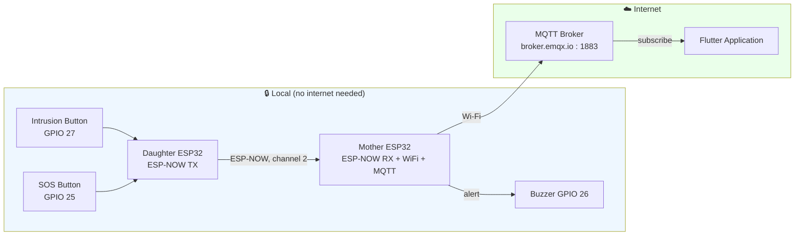

> The critical path **Button → Daughter → Mother → Buzzer** uses only ESP-NOW and works even if Wi-Fi/internet are down. MQTT adds the cloud + Flutter leg.

---

## 2. High-Level Architecture

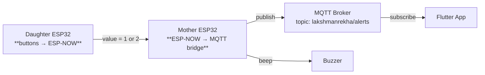

**ASCII fallback:**

```
 Daughter ESP32                 Mother ESP32                   MQTT Broker                Flutter App
+--------------+    ESP-NOW    +---------------+   Wi-Fi    +--------------------+  sub   +---------+
| GPIO 27 → 1  | ────────────▶ |  ESP-NOW RX   | ─────────▶ | broker.emqx.io     | ──────▶ |  alerts |
| GPIO 25 → 2  |  channel 2    |  + WiFi + MQTT|  publish   | lakshmanrekha/alerts|        +---------+
+--------------+               +-------+-------+            +--------------------+
                                       │
                                       ▼
                                   [Buzzer GPIO 26]
```

---

## 3. Node Responsibilities

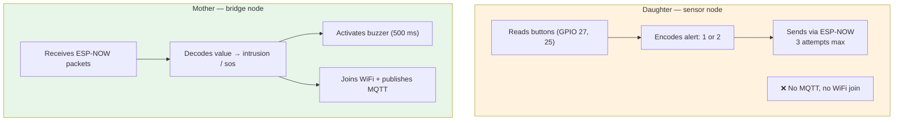

| Capability | Daughter | Mother |
|---|---|---|
| Buttons | ✅ | ❌ |
| ESP-NOW transmit | ✅ | ❌ |
| ESP-NOW receive | ❌ | ✅ |
| Buzzer | ❌ | ✅ (GPIO 26) |
| Wi-Fi / MQTT | ❌ | ✅ |
| Internet bridge | ❌ | ✅ |

---

## 4. Project Tree

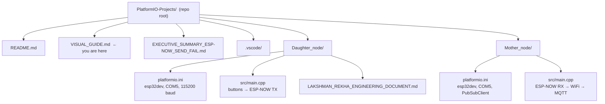

**ASCII fallback:**

```
PlatformIO-Projects/
├── README.md
├── VISUAL_GUIDE.md                 ← this file
├── EXECUTIVE_SUMMARY_ESP-NOW_SEND_FAIL.md
├── .vscode/
├── Daughter_node/
│   ├── platformio.ini              (esp32dev · COM5 · monitor 115200)
│   ├── src/main.cpp                (buttons → ESP-NOW transmitter)
│   └── LAKSHMAN_REKHA_ENGINEERING_DOCUMENT.md
└── Mother_node/
    ├── platformio.ini              (esp32dev · COM5 · PubSubClient@^2.8)
    └── src/main.cpp                (ESP-NOW receiver → Wi-Fi → MQTT)
```

> **Note:** both projects use `upload_port = COM5` — flash one board at a time or change the port for the second board.

---

## 5. Hardware Wiring

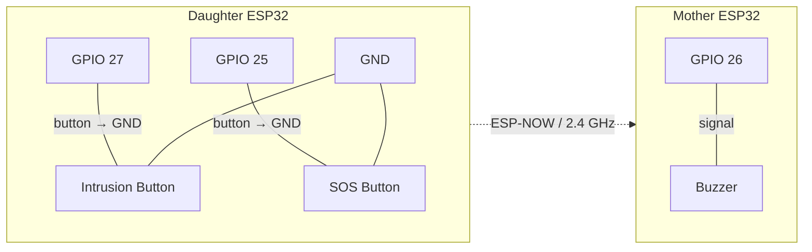

| Device | GPIO | Function | Logic | Wiring |
|---|---|---|---|---|
| Daughter | 27 | Intrusion button | `INPUT_PULLUP`, **active-low** | GPIO 27 → button → GND |
| Daughter | 25 | SOS button | `INPUT_PULLUP`, **active-low** | GPIO 25 → button → GND |
| Mother | 26 | Buzzer | active-high output | GPIO 26 → buzzer → GND |

**Button polarity (INPUT_PULLUP):**

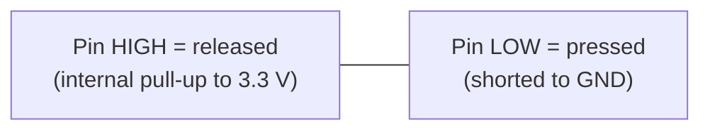

> Both buttons trigger only on the **falling edge** (`LOW` after previously `HIGH`), so one press = one event. A `delay(200)` debounce follows each send.

---

## 6. Alert Data Flow

### Intrusion

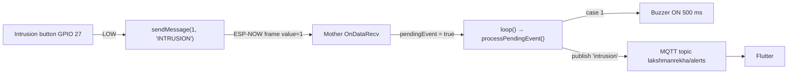

### SOS

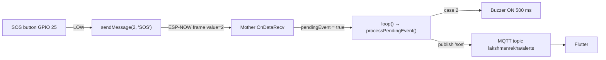

---

## 7. End-to-End Sequence (Intrusion)

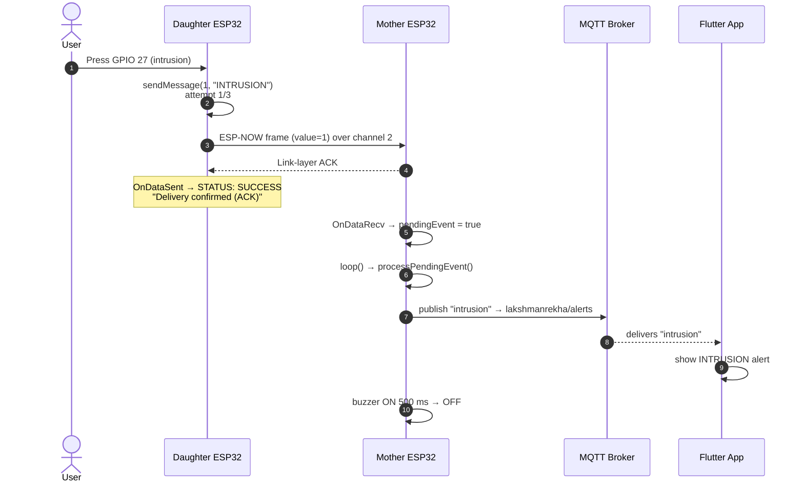

> If the Mother never ACKs, the Daughter retries (see [Section 11](#11-esp-now-reliability--retry)).

---

## 8. Message Protocol

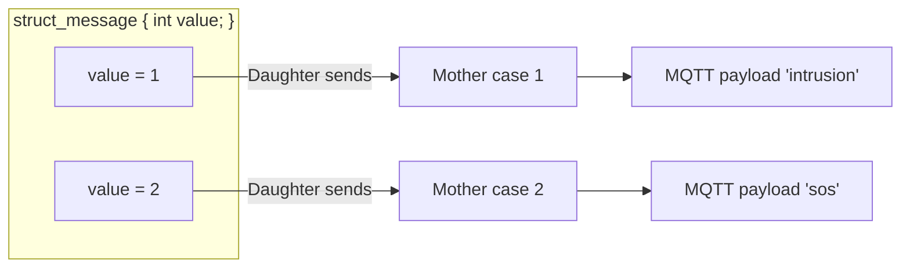

| Value | Meaning | Daughter action | Mother action | MQTT payload |
|---|---|---|---|---|
| `1` | Intrusion | `sendMessage(MSG_INTRUSION, "INTRUSION")` | `case 1:` → buzzer + publish | `intrusion` |
| `2` | SOS | `sendMessage(MSG_SOS, "SOS")` | `case 2:` → buzzer + publish | `sos` |

> The struct must stay **byte-identical on both nodes** — the Mother rejects packets whose size ≠ `sizeof(struct_message)`.

---

## 9. ESP-NOW Channel Alignment

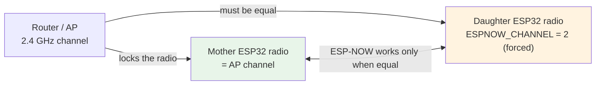

**The rule:**

```
Router/AP channel  =  Mother radio channel  =  Daughter ESP-NOW channel (2)
```

- The **Daughter** hard-forces channel **2** with the promiscuous trick and verifies it with `esp_wifi_get_channel()` (`CHANNEL CHECK: PASS/FAILED`).
- The **Mother's** `#define ESPNOW_CHANNEL 10` is **label-only** — its radio follows the Wi-Fi AP. It prints `Actual Wi-Fi Channel: N` at boot.
- **Current consequence:** your router must be on **channel 2**, or every send ends in `STATUS: FAILED`.

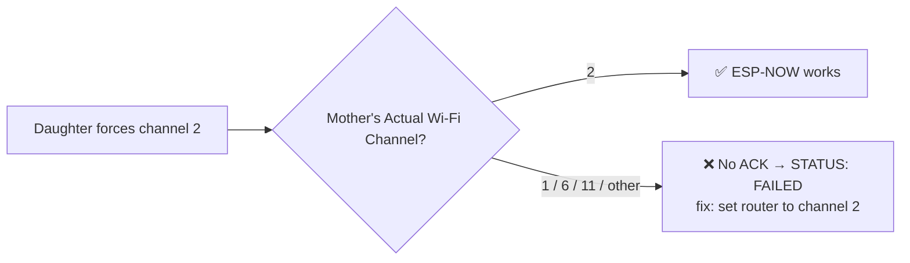

---

## 10. Boot Sequences

### Daughter boot (state diagram)

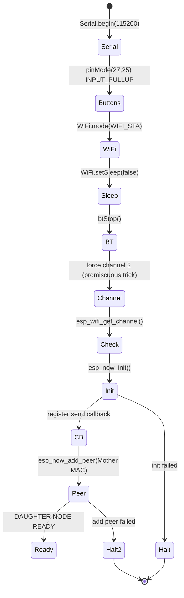

### Mother boot (state diagram)

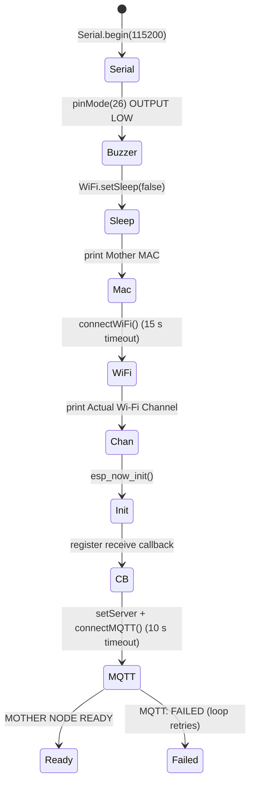

---

## 11. ESP-NOW Reliability & Retry

### `esp_now_send()` vs callback verdict

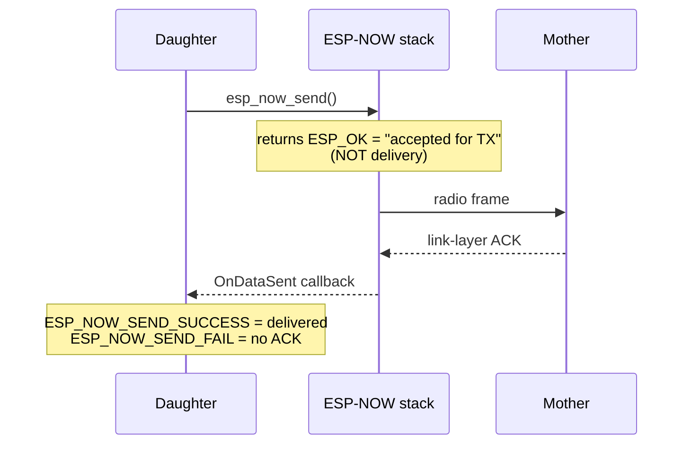

### Current retry flow (Daughter `sendMessage()`)

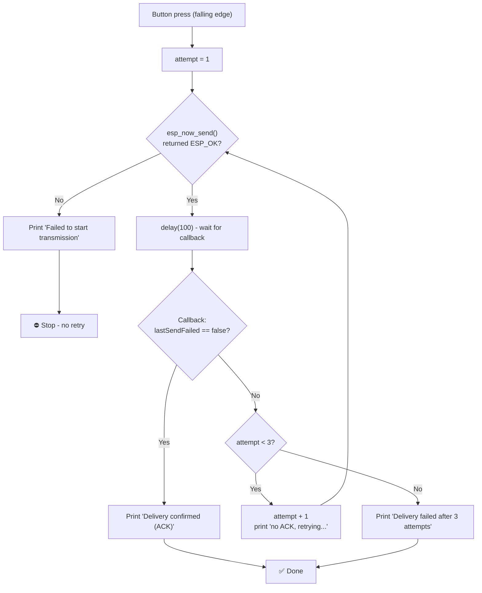

| Knob | Current value |
|---|---|
| Max attempts | `3` |
| Wait per attempt | `delay(100)` (blocking) |
| Extra retry gap | none (the 100 ms wait doubles as it) |
| Success print | `[SEND] Delivery confirmed (ACK)` |
| Exhaustion print | `[SEND] ERROR: Delivery failed after 3 attempts` |
| Application-level ACK | ❌ **not implemented** — "ACK" is only the Wi-Fi link-layer ACK |

---

## 12. MQTT Bridge

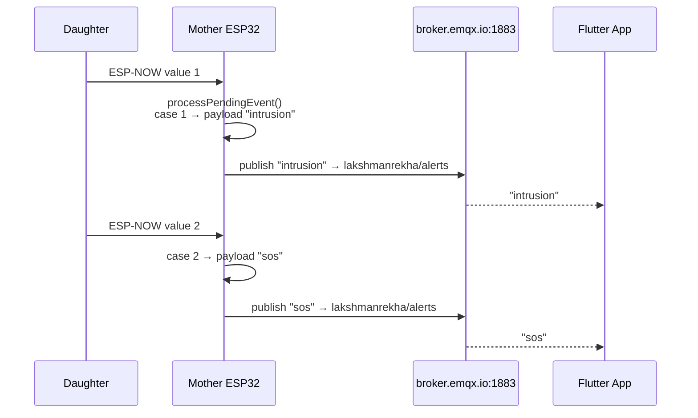


> **Security:** plaintext port 1883 on a public broker; `peerInfo.encrypt = false` — prototype only (see README §19).

---

## 13. Troubleshooting Decision Tree

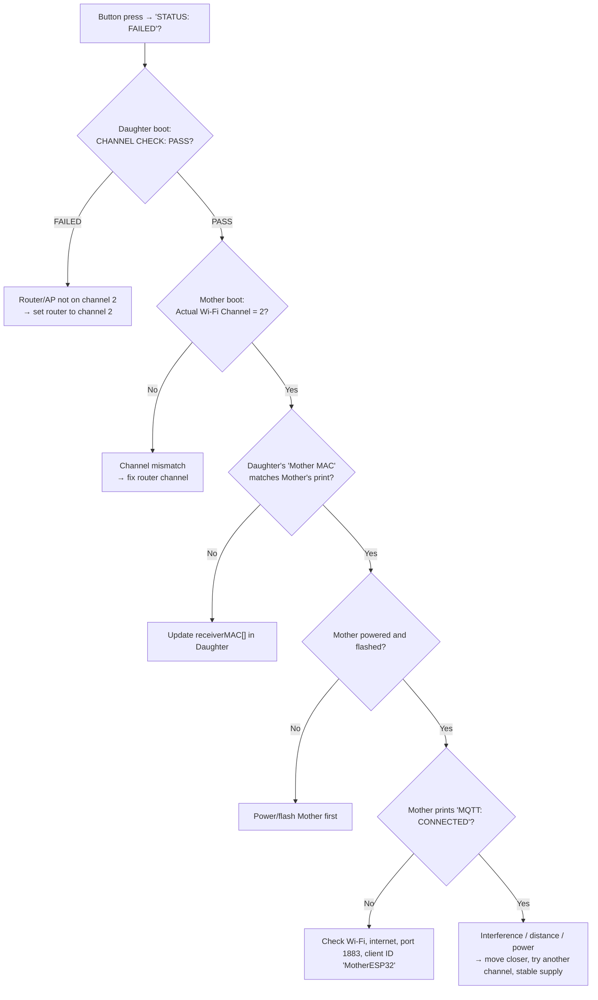

**Quick symptom map:**

| Symptom | Look at | Likely cause |
|---|---|---|
| `STATUS: FAILED` always | both `CHANNEL CHECK` lines | channel mismatch |
| `STATUS: FAILED` sometimes | distance / power | RF range or supply |
| No `[ESPNOW]` line on Mother | Mother channel print | router channel ≠ 2 |
| `MQTT: FAILED` | rc codes (`-2`, `5`, …) | broker unreachable / ID clash |
| No `[BUTTON]` print | wiring | button not LOW on press |
| Wrong alert shown | struct + cases | value/payload mapping drift |

---

## 14. Future: Multiple Daughter Nodes

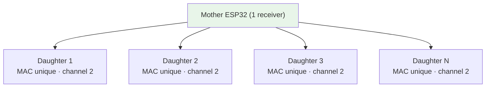

- All Daughters share the **same channel** and the **same Mother MAC**.
- The Mother currently accepts any sender; sender identity exists only via the optional `expectedDaughterMAC` (supports one, default `00:00:00:00:00:00` = disabled).
- A future struct could add `device_id`, `event_type`, `timestamp`, `battery` — **this is future work; the current struct is `{ int value; }` only.**

```mermaid
flowchart LR
    NOW["Now: struct_message { int value; }"] --> FUT["Future: { device_id, event_type, timestamp, battery, … }"]
    style NOW fill:#fff3e0
    style FUT fill:#e8f5e9
```

---

## 15. Quick Reference Map

```mermaid
flowchart LR
    subgraph D["DAUGHTER"]
        D1["Role: buttons → ESP-NOW TX"]
        D2["Mother MAC: B0:CB:D8:C6:A5:A8"]
        D3["ESP-NOW channel: 2 (forced)"]
        D4["GPIO 27 = intrusion · GPIO 25 = SOS"]
        D5["Retries: 3 × 100 ms"]
    end

    subgraph M["MOTHER"]
        M1["Role: ESP-NOW RX → MQTT bridge"]
        M2["Wi-Fi: SSMhaskar_0879 (password: SECRET)"]
        M3["MQTT: broker.emqx.io:1883"]
        M4["Topic: lakshmanrekha/alerts"]
        M5["Buzzer GPIO 26 (500 ms)"]
    end

    subgraph MSG["MESSAGES"]
        V1["1 = intrusion → 'intrusion'"]
        V2["2 = sos → 'sos'"]
    end

    D --> MSG --> M
```

| Item | Value |
|---|---|
| Daughter channel | `2` (hardcoded, forced) |
| Mother MAC (target) | `B0:CB:D8:C6:A5:A8` |
| MQTT broker / port / topic | `broker.emqx.io` / `1883` / `lakshmanrekha/alerts` |
| Payloads | `intrusion` (value 1), `sos` (value 2) |
| Serial baud / monitor | `115200` |
| Build / flash / monitor | `pio run` · `pio run --target upload` · `pio device monitor` |

---

*Generated from the current source. If you change firmware, re-check the diagrams — especially [§9 channel](#9-esp-now-channel-alignment) and [§8 message values](#8-message-protocol).*
